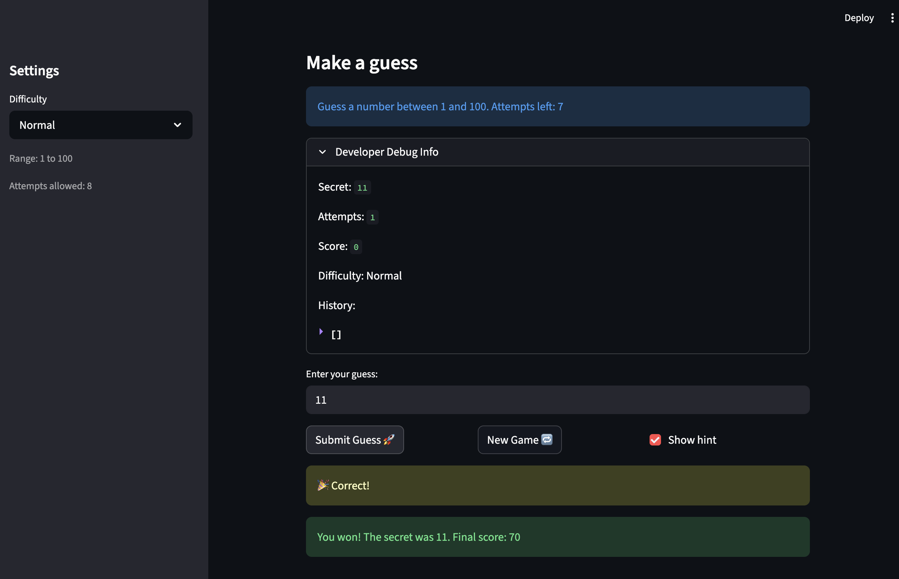

# 🎮 Game Glitch Investigator: The Impossible Guesser

## 🚨 The Situation

You asked an AI to build a simple "Number Guessing Game" using Streamlit.
It wrote the code, ran away, and now the game is unplayable. 

- You can't win.
- The hints lie to you.
- The secret number seems to have commitment issues.

## 🛠️ Setup

1. Install dependencies: `pip install -r requirements.txt`
2. Run the broken app: `python -m streamlit run app.py`

## 🕵️‍♂️ Your Mission

1. **Play the game.** Open the "Developer Debug Info" tab in the app to see the secret number. Try to win.
2. **Find the State Bug.** Why does the secret number change every time you click "Submit"? Ask ChatGPT: *"How do I keep a variable from resetting in Streamlit when I click a button?"*
3. **Fix the Logic.** The hints ("Higher/Lower") are wrong. Fix them.
4. **Refactor & Test.** - Move the logic into `logic_utils.py`.
   - Run `pytest` in your terminal.
   - Keep fixing until all tests pass!

## 📝 Document Your Experience

**Game Purpose:**
Glitchy Guesser is a number-guessing game built with Streamlit. The player selects a difficulty (Easy: 1–20, Normal: 1–100, Hard: 1–50) and tries to guess a randomly chosen secret number within a limited number of attempts. Each wrong guess gives a directional hint ("Go Higher" or "Go Lower"), and the score decreases with each wrong guess. Guessing correctly rewards points based on how few attempts were used.

**Bugs Found:**

1. **Inverted Higher/Lower hints** — `check_guess` returned "Go HIGHER" when the guess was too high and "Go LOWER" when it was too low — the exact opposite of correct.
2. **Inconsistent score deductions** — `update_score` had special-case logic that *added* 5 points on even-numbered attempts for "Too High" guesses, while "Too Low" always subtracted 5. There was no logical reason for this asymmetry.
3. **`new_game` only partially reset state** — The original handler reset `attempts` and `secret` (always using a hardcoded 1–100 range), but left `score`, `status`, and `history` untouched. This caused old scores and guess history to carry over, and a previous "won" or "lost" status would immediately block the new game.
4. **Secret cast to string on even attempts** — Inside the submit handler, the secret was conditionally converted to a string (`str(st.session_state.secret)`) when `attempts % 2 == 0`. This caused `check_guess` to compare an `int` guess against a `str` secret on alternate attempts, making a correct guess impossible on even turns.

**Fixes Applied:**

1. **Hint direction** — Swapped the return values in `check_guess` so `guess > secret` returns "Go LOWER" and `guess < secret` returns "Go HIGHER".
2. **Score logic** — Rewrote `update_score` so both "Too High" and "Too Low" consistently subtract 5 points, removing the even-attempt branch that was incorrectly adding points.
3. **`new_game` reset** — Extended the handler to also reset `score` to `0`, `status` to `"playing"`, and `history` to `[]`, and replaced the hardcoded `random.randint(1, 100)` with `random.randint(low, high)` so the new secret respects the selected difficulty.
4. **Type-safe secret** — Removed the conditional string cast and replaced it with `secret = st.session_state.secret` so the secret is always an `int` when passed to `check_guess`.

## 📸 Demo  

## 🚀 Stretch Features

- [ ] [If you choose to complete Challenge 4, insert a screenshot of your Enhanced Game UI here]
